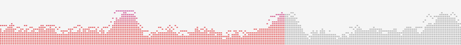

# audio-flow

Interactive navigable audio visualization with two predefined visualizers.

This project is a remake of [studiomikan's](https://github.com/studiomikan/pon-audio-spectrum) project, rewritten on js as a downloadable npm package, with optimizations and added features.

```sh
npm install audio-flow
```

## BlockVisualizer



Visualizer with dynamic adjust based on sceen and css with no performance downscaling caused by resize scaling effects

```js
// <canvas ref="canvasWrapper" style="width: 100%; height: 90px" />

import { Howl, Howler } from 'howler'
import { BlockVisualizer, AudioSpectrum } from 'audio-flow'

const options = {
  blockWidth: 2,
  blockHeight: 2,
  marginh: 1,
  marginv: 1,
  colors: ['#b6b6b6'],
  canvas: this.$refs.canvasWrapper,
  playbackColors: ['#e66465', '#c75db5', '#9198e5'],
  playbackGradientStops: [0.3, 0.7]
}
const as = new AudioSpectrum(new BlockVisualizer(options))
const soundHowl = new Howl({
  src: 'audio source',
  autoplay: false
})

as.setAudio(this.soundHowl, Howler.ctx)

soundHowl?.play()
```